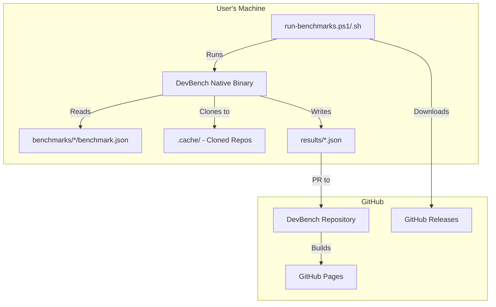
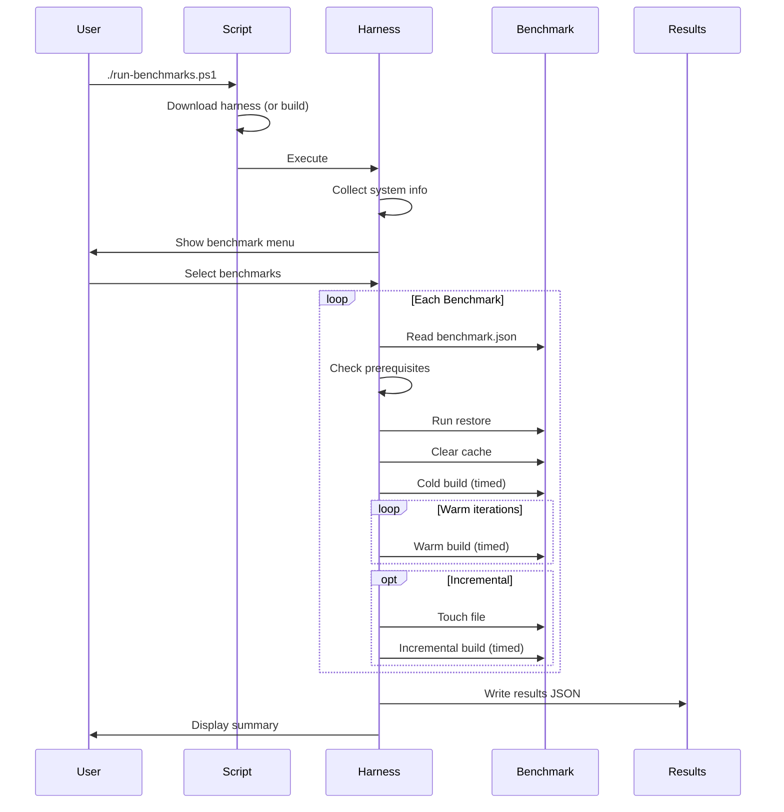
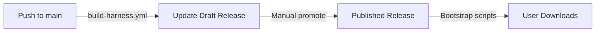

# DevBench Architecture

## Overview

DevBench is a developer PC benchmarking tool that measures build performance for .NET projects.

## Components

### Bootstrap Scripts (`run-benchmarks.ps1`, `run-benchmarks.sh`)

Thin wrappers that:
1. Detect OS and architecture
2. Check for pre-built harness in GitHub Releases
3. Download native binary OR build locally (dev mode)
4. Execute harness with forwarded arguments

### Test Harness (`src/DevBench.cs`)

File-based .NET 10 app compiled to native AOT. Responsibilities:
- Parse command-line arguments
- Display interactive benchmark selection menu
- Collect system information
- Read benchmark manifests
- Execute benchmark phases (prereqs → restore → build)
- Measure and record timings
- Generate results JSON

### Benchmark Manifests (`benchmarks/*/benchmark.json`)

JSON files defining:
- Benchmark metadata (name, description, tags)
- Type (in-repo or external-repo)
- Prerequisites to check
- Commands for restore, cache clear, build
- Iteration counts and timeouts

### Results (`results/*.json`)

User-submitted benchmark results containing:
- System information (OS, CPU, memory, storage)
- Benchmark timings (cold, warm, incremental)
- Statistics (min, max, mean, median, stddev)

### Website (`site/`)

Eleventy static site that:
- Reads all results JSON files
- Displays filterable/sortable results table
- Deployed to GitHub Pages

## Data Flow

## Benchmark Execution

Each benchmark goes through these phases:

1. **Prerequisites Check** - Verify required tools installed
2. **Clone** (external repos only) - Shallow clone to `.cache/`
3. **Restore** - Download dependencies (not timed)
4. **Cache Clear** - Clean build artifacts
5. **Cold Build** - First build, timed
6. **Warm Builds** - Multiple iterations, timed
7. **Incremental Build** - Touch file, rebuild, timed

## Extension Points

### Adding New Benchmarks
- Create `benchmarks/<name>/benchmark.json`
- For in-repo: add source to `benchmarks/<name>/src/`
- For external: specify `repoUrl` and `repoRef`

### Adding New Stacks (Future)
The schema supports non-.NET benchmarks:
- Different `prerequisites` (node, cargo, go)
- Different `build.full.command` values
- Stack-specific `tags` for filtering

### Adding System Info
- Modify `CollectSystemInfo()` in `DevBench.cs`
- Use platform conditionals (`#if WINDOWS`)
- Update results schema documentation

## Release Process

1. Every push to `main` triggers `build-harness.yml`
2. Builds native AOT for 6 platforms
3. Updates standing draft release with CI binaries
4. Manual promotion creates versioned release
5. Bootstrap scripts download from latest release
